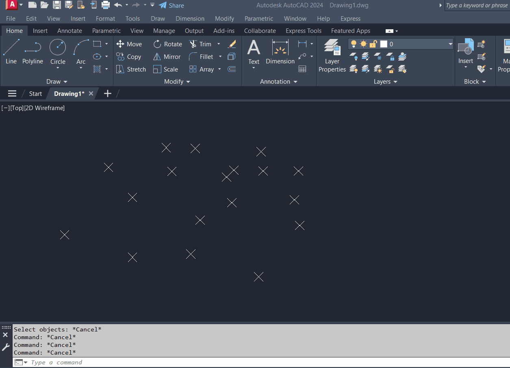

// Simple Convex Hull

This is a small C++ project for computing the convex hull of 2D points.  
It was written to better understand how the algorithm works and to test it inside AutoCAD using ObjectARX.

// About the Algorithm

The idea is simple:  
1. Find the point with the lowest Y (and X if tied).  
2. Sort all points by the angle from that base point.  
3. Walk through the list and keep only the points that make a left turn.  

The result is the convex polygon that wraps around all the input points.

// Files

- **MyConvexHull.h** – the main class (`SimpleHull`)  
- **test_convex_hull.cpp** – used in AutoCAD for testing with polylines, lines, and points  
- **demo.gif** – example result from the ObjectARX test

